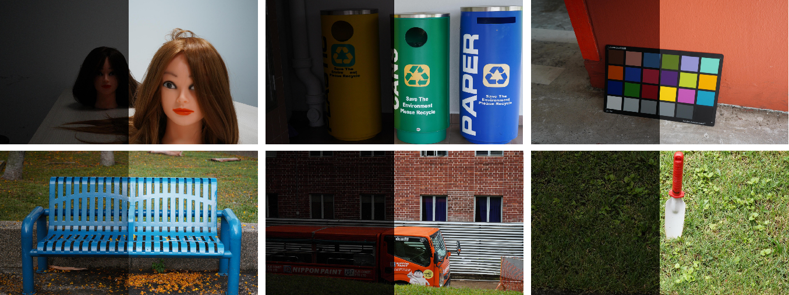

## Embedding Fourier for Ultra-High-Definition Low-Light Image Enhancement (ICLR 2023 Oral)

[Paper]( ) | [Project Page](https://li-chongyi.github.io/UHDFour/) 

[Chongyi Li](https://li-chongyi.github.io/), [Chun-Le Guo](https://scholar.google.com.au/citations?user=RZLYwR0AAAAJ&hl=en),  [Man Zhou](https://manman1995.github.io/),  [Zhexin Liang](https://zhexinliang.github.io/),  [Shangchen Zhou](https://shangchenzhou.com/),  [Ruicheng Feng](https://jnjaby.github.io/),   [Chen Change Loy](https://www.mmlab-ntu.com/person/ccloy/) 

S-Lab, Nanyang Technological University; Nankai University

### Updates

- **2023.01.30**:  This repo is created.


---

### UHD-LL Dataset

(The datasets are hosted on both Google Drive and BaiduPan)
| Dataset | Link | Number | Description|
| :----- | :--: | :----: | :---- | 
| UHD-LL| [Google Drive]() / [BaiduPan (key: dz6u)]() | 2,150 | A total of 2,000 pairs for training and 150 pairs for testing.|


<details close>
<summary>[Unfold] for detailed description of each folder in UHD-LL dataset:</summary>

<table>
<td>

| UDH-LL               | Description             |
| :----------------------- | :---------------------- |
| training_set/gt                 | normal-light images |
| training_set/input          | low-light  images |
| testing_set/gt               | normal-light images |
| testing_set/input          |low-light  images |

</td>
</table>


</details>


### Dependencies and Installation

- Pytorch >= 1.7.1
- CUDA >= 10.1
- Other required packages in `requirements.txt`
```

```

### Quick Inference
Before performing the following steps, please download our pretrained model first.

 **Download Links:** [[Google Drive](] [[Baidu Disk (password: )]()]

Then, unzip the file and place the models to `ckpts/<dataset_name>` directory, separately.

The directory structure will be arranged as:
```
ckpts
   |- UHD
      |- XX.pt  
   |- LOL
      |- 
   |- LOL2
      |- 
```

We provide some classic test images in the [`classic_test_image`](./data/classic_test_image/) directory.

Run the following command to process them:
```shell

CUDA_VISIBLE_DEVICES=X python src/test_PSNR.py --dataset-name our_test  

```
The enhanced images will be saved in the `results/` directory.

You can also run the following command to process your own images:
```
CUDA_VISIBLE_DEVICES=X python src/test_PSNR.py \
  --dataset-name our_test -t path/to/your/test/folder   
```

### Train
See `python3 src/train.py --h` for list of optional arguments, or `train.sh` for examples.

An example of NH-HAZE dataset.
```
CUDA_VISIBLE_DEVICES=0,1 python src/train.py \
  --dataset-name NH \
  --train-dir ./data/train_NH/ \
  --valid-dir ./data/valid_NH/ \
  --ckpt-save-path ../ckpts \
  --ckpt-overwrite \
  --nb-epochs 5000 \
  --batch-size 2\
  --train-size 800 1200  \
  --valid-size 800 1200 \
  --loss l1 \
  --plot-stats \
  --cuda   


### License

This project is licensed under <a rel="license" href="https://github.com/sczhou/LEDNet/blob/master/LICENSE">S-Lab License 1.0</a>. Redistribution and use for non-commercial purposes should follow this license.

### Acknowledgement

This project is based on [BasicSR](https://github.com/XPixelGroup/BasicSR). We calculate evaluation metrics using [IQA-PyTorch](https://github.com/chaofengc/IQA-PyTorch) toolbox. Thanks for their awesome works.

### Citation
If our work is useful for your research, please consider citing:

```bibtex
@InProceedings{zhou2022lednet,
    author = {Zhou, Shangchen and Li, Chongyi and Loy, Chen Change},
    title = {LEDNet: Joint Low-light Enhancement and Deblurring in the Dark},
    booktitle = {ECCV},
    year = {2022}
}
```

### Contact
If you have any questions, please feel free to reach me out at `shangchenzhou@gmail.com`.
